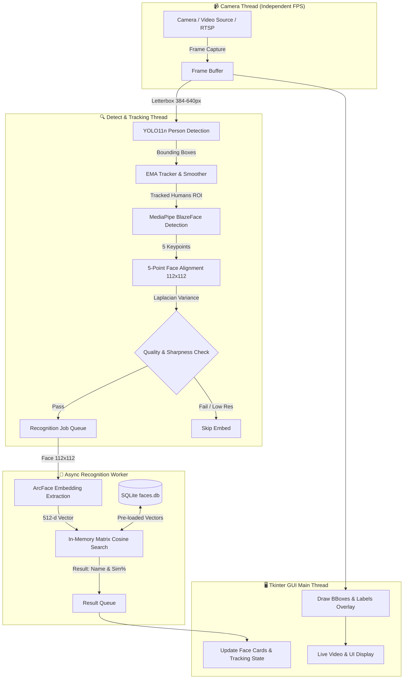

# 🎭 Real-Time Multi-Person Face Recognition System
### ระบบตรวจจับและระบุตัวตนใบหน้าแบบเรียลไทม์ (YOLO11 + MediaPipe + ArcFace + SQLite)

<div align="center">

[](https://www.python.org/)
[](https://opencv.org/)
[](https://github.com/ultralytics/ultralytics)
[](https://developers.google.com/mediapipe)
[](https://github.com/serengil/deepface)
[](https://www.sqlite.org/)
[](LICENSE)

</div>

---

## 📖 สารบัญ (Table of Contents)
- [ภาพรวมของระบบ (Overview)](#-ภาพรวมของระบบ-overview)
- [คุณสมบัติเด่น (Key Features)](#-คุณสมบัติเด่น-key-features)
- [สถาปัตยกรรมและขั้นตอนการทำงาน (Architecture & Pipeline)](#-สถาปัตยกรรมและขั้นตอนการทำงาน-architecture--pipeline)
- [โครงสร้างโฟลเดอร์ (Project Structure)](#-โครงสร้างโฟลเดอร์-project-structure)
- [ความต้องการของระบบ (Requirements)](#-ความต้องการของระบบ-requirements)
- [ขั้นตอนการติดตั้ง (Installation)](#-ขั้นตอนการติดตั้ง-installation)
- [วิธีการใช้งาน (Usage Guide)](#-วิธีการใช้งาน-usage-guide)
  - [1. เริ่มต้นระบบหลัก (Main Application)](#1-เริ่มต้นระบบหลัก-main-application)
  - [2. การจัดการฐานข้อมูลใบหน้า (Face DB Manager)](#2-การจัดการฐานข้อมูลใบหน้า-face-db-manager)
  - [3. ปุ่มลัดบนคีย์บอร์ด (Keyboard Shortcuts)](#3-ปุ่มลัดบนคีย์บอร์ด-keyboard-shortcuts)
- [การตั้งค่าและโปรไฟล์ความเร็ว (Configuration & Profiles)](#-การตั้งค่าและโปรไฟล์ความเร็ว-configuration--profiles)
- [การแก้ไขปัญหาเบื้องต้น (Troubleshooting)](#-การแก้ไขปัญหาเบื้องต้น-troubleshooting)

---

## 🌟 ภาพรวมของระบบ (Overview)

ระบบนี้เป็นโปรแกรมสำหรับ**ตรวจจับ ติดตาม และระบุตัวตนบุคคลแบบเรียลไทม์ (Multi-Person Face Recognition)** โดยใช้กล้อง Webcam, ไฟล์วิดีโอ, หรือ RTSP Stream 

ระบบถูกออกแบบด้วยสถาปัตยกรรมแบบ **Multi-Threading** แยกการทำงานระหว่าง **Camera Stream**, **Object Detection**, **Face Recognition Inference**, และ **GUI Rendering** ออกจากกัน เพื่อให้การแสดงผลภาพจากกล้องมีความลื่นไหลระดับสูง (High FPS) และไม่เกิดอาการกระตุกหรือค้างขณะประมวลผลโมเดล AI

---

## ✨ คุณสมบัติเด่น (Key Features)

- 🎯 **Human Detection & Tracking (YOLO11n + EMA Tracker)**:
  - ตรวจจับบุคคลในเฟรมภาพด้วย `YOLO11n` ที่มีความเร็วและความแม่นยำสูง
  - ใช้อัลกอริทึม **EMA (Exponential Moving Average)** ร่วมกับ IoU และ Size Ratio ในการติดตาม (Track) ตำแหน่งของแต่ละคนอย่างต่อเนื่อง ป้องกันการสับสนระหว่างบุคคล

- 📐 **5-Point Face Alignment (MediaPipe BlazeFace + Affine Transform)**:
  - ตรวจจับใบหน้าภายในกรอบของบุคคลด้วย `BlazeFace (Short Range)`
  - สกัด Landmark 5 จุดสำคัญ (ตาซ้าย, ตาขวา, จมูก, มุมปากซ้าย, มุมปากขวา) และคำนวณ Similarity Transform ปรับองศาใบหน้าให้ตรงตามมาตรฐาน **ArcFace Template (112×112 px)** ช่วยเพิ่มความแม่นยำแม้เอียงศีรษะ

- 🧠 **Deep Vector Embedding (ArcFace 512-dim)**:
  - สกัด Feature Vector เอกลักษณ์ของใบหน้าความละเอียด 512 มิติ ด้วยโมเดล **ArcFace**
  - มีระบบ **Test-Time Augmentation (TTA)** (กลับภาพซ้าย-ขวาเพื่อเฉลี่ยเวกเตอร์) และ **L2 Normalization** ก่อนจัดเก็บหรือเปรียบเทียบ

- ⚡ **In-Memory Blended Cosine Search**:
  - ค้นหาและจับคู่ใบหน้าด้วยการคูณเมทริกซ์ (Matrix Multiplication) บน RAM ความเร็วระดับมิลลิวินาที
  - ใช้วิธี **Blended Person Scoring** (คำนวณคะแนนร่วมกันระหว่าง Best Match 75% และ Top-5 Mean 25%) พร้อม **Threshold** และ **Match Margin** ป้องกันการระบุตัวตนผิดพลาด (False Positive)

- 🖥️ **Modern Desktop GUI & Responsive Display**:
  - แสดงผลกล้องแบบ Letterbox ปรับขนาดอัตโนมัติตามขนาดหน้าต่าง
  - แผงด้านข้างแสดงรูปถ่ายใบหน้า (Face Thumbnail), ชื่อบุคคล, ค่าความคล้าย (Similarity %), และสถานะการประมวลผล
  - สลับ Source กล้อง (Camera 0 / Camera 1) ได้ทันทีผ่าน Dropdown หรือปุ่มลัด

- 🗄️ **Integrated Face Database Manager**:
  - ระบบจัดการรายชื่อในตัว: เพิ่มคนใหม่ผ่านกล้อง (ถ่ายรูปพร้อมระบบตรวจจับอัตโนมัติ), เพิ่มจากไฟล์รูปภาพ (JPG, PNG, WebP), และลบข้อมูล
  - มีระบบ **Async Background Reloading** โหลดข้อมูลคนใหม่เข้าสู่หน่วยความจำโดยไม่หยุดการทำงานของกล้อง

---

## 🏗️ สถาปัตยกรรมและขั้นตอนการทำงาน (Architecture & Pipeline)



### การแบ่งหน้าที่ของเธรด (Thread Breakdown)
1. **`camera_thread`**: ดึงเฟรมจากกล้อง/วิดีโออย่างสม่ำเสมอ คำนวณค่า FPS จริงของฮาร์ดแวร์
2. **`detect_thread`**: ประมวลผล YOLO11 และ MediaPipe เพื่อระบุตำแหน่งคนและใบหน้า
3. **`recognition_worker`**: คำนวณ Deep Vector และเปรียบเทียบกับฐานข้อมูลแบบ Asynchronous
4. **`GUI loop`**: วาดผลลัพธ์ Overlay, อัปเดตการ์ดสถานะใบหน้า, รับ Event แป้นพิมพ์และเมาส์

---

## 📁 โครงสร้างโฟลเดอร์ (Project Structure)

```text
Detector/
├── Code/
│   ├── main.py              # สคริปต์หลัก ควบคุมเธรด กล้อง และ UI Loop
│   ├── gui.py               # ส่วนติดต่อผู้ใช้หลัก (Tkinter + PIL Video Canvas)
│   ├── db_manager.py        # หน้าต่างจัดการฐานข้อมูลบุคคล (Webcam/File Import/Delete)
│   ├── detecthuman.py       # ตรวจจับคนด้วย YOLO11n + Letterbox Padding
│   ├── detect_facev2.py     # ตรวจจับใบหน้าและทำ 5-point Landmark Alignment (MediaPipe)
│   ├── detect_face.py       # โมดูลตรวจจับใบหน้าเวอร์ชันพื้นฐาน
│   ├── face_embedding.py    # สกัดเวกเตอร์ ArcFace 512-dim + Normalization + TTA
│   ├── face_db.py           # ระบบฐานข้อมูล SQLite + In-memory Cosine Index Search
│   ├── camera.py            # จัดการเปิดกล้อง Webcam, RTSP, หรือไฟล์วิดีโอ
│   └── runtime_config.py    # กำหนดค่า Profile ความเร็วและ Parameter ระบบ
├── Model/
│   ├── yolov11n.pt          # โมเดลน้ำหนัก YOLO11n (Person Detection)
│   ├── blaze_face_short_range.tflite # โมเดล MediaPipe Face Detection
│   └── face_landmarker.task # โมเดล MediaPipe Landmark Detection
├── faces.db                 # ฐานข้อมูล SQLite สำหรับบันทึกชื่อและเวกเตอร์ใบหน้า
├── requirements.txt         # รายการแพ็กเกจหลักที่จำเป็น
├── reqis.txt                # รายการแพ็กเกจทั้งหมด (Frozen dependencies)
└── README.md                # เอกสารคู่มือการใช้งานระบบ
```

---

## 💻 ความต้องการของระบบ (Requirements)

- **ระบบปฏิบัติการ**: Windows 10/11, Ubuntu 20.04+, หรือ macOS
- **Python**: เวอร์ชัน **3.10** หรือ **3.11** (แนะนำ)
- **ฮาร์ดแวร์**:
  - **CPU**: Intel Core i3 / AMD Ryzen 3 ขึ้นไป (รองรับโปรไฟล์ `low` หรือ `balanced`)
  - **GPU (ทางเลือก)**: NVIDIA GPU รองรับ CUDA เพื่อเพิ่มความเร็วของ YOLO และ ArcFace (สำหรับโปรไฟล์ `high`)
  - **กล้อง**: USB Webcam หรือกล้อง Built-in ความละเอียด 720p ขึ้นไป

---

## 📦 ขั้นตอนการติดตั้ง (Installation)

### 1. Clone หรือเปิดโฟลเดอร์โปรเจกต์
```bash
cd d:/CountPIG/Detector
```

### 2. สร้างและเปิดใช้งาน Virtual Environment (แนะนำ)
```bash
# Windows
python -m venv .venv
.venv\Scripts\activate

# Linux / macOS
python3 -m venv .venv
source .venv/bin/activate
```

### 3. ติดตั้ง Dependencies
```bash
pip install --upgrade pip
pip install -r requirements.txt
```

> **หมายเหตุ**: หากต้องการติดตั้ง Dependencies แบบระบุเวอร์ชันตรงกันทั้งหมด สามารถใช้:
> ```bash
> pip install -r reqis.txt
> ```

### 4. ตรวจสอบไฟล์โมเดล (Model Files)
ตรวจสอบว่าในโฟลเดอร์ `Model/` มีไฟล์เหล่านี้ครบถ้วน:
- `Model/yolov11n.pt`
- `Model/blaze_face_short_range.tflite`

---

## 🚀 วิธีการใช้งาน (Usage Guide)

### 1. เริ่มต้นระบบหลัก (Main Application)
รันคำสั่งจากโฟลเดอร์ Root หรือ Code:
```bash
python Code/main.py
```
- เมื่อโปรแกรมเริ่มต้น จะมีหน้าต่าง File Dialog ขึ้นมาถามว่าต้องการ **"เลือกไฟล์วิดีโอเพื่อทดสอบ"** หรือไม่:
  - หากเลือกไฟล์วิดีโอ (`.mp4`, `.avi`, `.mkv` ฯลฯ) ระบบจะเล่นวิดีโอวนซ้ำเพื่อทดสอบ
  - หากกด **Cancel** ระบบจะเปิดกล้อง **Webcam (Camera 0)** โดยอัตโนมัติ

---

### 2. การจัดการฐานข้อมูลใบหน้า (Face DB Manager)

คุณสามารถเปิดหน้าต่างจัดการข้อมูลบุคคลได้ 2 วิธี:
1. **ผ่านหน้าต่างหลัก**: คลิกปุ่ม **"Edit info"** ที่มุมขวาบนของหน้าจอ
2. **รันแบบ Standalone**:
   ```bash
   python Code/db_manager.py
   ```

#### ฟังก์ชันใน Face Database Manager:
- ➕ **เพิ่มคนใหม่ผ่านกล้อง (Capture Window)**:
  - กดปุ่ม **"＋ เพิ่มคนใหม่"** กรอกชื่อ-นามสกุล
  - ส่องหน้าให้อยู่ในกรอบ แล้วกดปุ่ม **CAPTURE** หรือกดปุ่ม **Spacebar** (สามารถถ่ายได้หลายมุมมองเพื่อเพิ่มความแม่นยำ)
  - กดปุ่ม **"บันทึก"**
- 🖼️ **เพิ่มคนใหม่จากไฟล์รูปภาพ (Import from Image)**:
  - กดปุ่ม **"🖼 จากรูปภาพ"** เลือกไฟล์ภาพจากคอมพิวเตอร์
  - ระบบจะตรวจจับใบหน้าอัตโนมัติ หากมีหลายคนในภาพ สามารถคลิกเลือกเฉพาะใบหน้าที่ต้องการได้
- ➕ **เพิ่มรูปเพิ่มเติมให้คนเดิม**:
  - คลิกปุ่ม **"เพิ่มรูป"** หรือ **"🖼 จากไฟล์"** ที่อยู่ด้านขวาของรายชื่อคนนั้น ๆ
- 🗑️ **ลบข้อมูลบุคคล**:
  - คลิกปุ่ม **"Delete"** และกดยืนยัน

---

### 3. ปุ่มลัดบนคีย์บอร์ด (Keyboard Shortcuts)

| ปุ่ม | การทำงาน |
|:---:|:---|
| <kbd>Q</kbd> | ปิดโปรแกรมและคืนทรัพยากรกล้อง |
| <kbd>R</kbd> | Reload ฐานข้อมูลใบหน้าใหม่แบบ Background ทันที |
| <kbd>0</kbd> | สลับไปใช้งาน Camera Source 0 (Webcam ตัวหลัก) |
| <kbd>1</kbd> | สลับไปใช้งาน Camera Source 1 (Webcam ตัวที่สอง) |
| <kbd>Space</kbd> | ถ่ายภาพ (ขณะอยู่ในหน้าต่างลงทะเบียนใบหน้า) |

---

### 4. การลงทะเบียนผ่าน Command Line (CLI)
คุณสามารถลงทะเบียนใบหน้าผ่าน CLI ได้โดยตรง:
```bash
python Code/face_db.py add "Somchai_Jaidee"
```
*(กด Spacebar เพื่อถ่ายภาพลงทะเบียน หรือกด Q เพื่อออก)*

---

## ⚙️ การตั้งค่าและโปรไฟล์ความเร็ว (Configuration & Profiles)

ระบบรองรับการตั้งค่าโปรไฟล์ประสิทธิภาพผ่าน Environment Variable `DETECT_PROFILE` เพื่อให้เหมาะสมกับสเปกฮาร์ดแวร์ของเครื่อง:

### โปรไฟล์การทำงาน (Hardware Profiles)

| พารามิเตอร์ | `low` (ค่าเริ่มต้น) | `balanced` (สมดุล) | `high` (ความแม่นยำสูง) |
|:---|:---:|:---:|:---:|
| **ความละเอียดกล้อง** | 1280×720 | 1280×720 | 1920×1080 |
| **FPS เป้าหมาย** | 24 FPS | 30 FPS | 30 FPS |
| **YOLO Image Size** | 384 px | 416 px | 640 px |
| **Human Detect Interval** | 0.12 วินาที | 0.07 วินาที | 0.05 วินาที |
| **Max Recognition Tracks** | 3 คน | 6 คน | 8 คน |
| **ความคมชัดขั้นต่ำ (Laplacian)** | 25.0 | 14.0 | 12.0 |
| **เหมาะสำหรับ** | เครื่องทั่วไป / CPU Only | เครื่องระดับกลาง / CPU แรง | เครื่องมี GPU การ์ดจอแยก |

### วิธีสลับโปรไฟล์:
```bash
# Windows (PowerShell)
$env:DETECT_PROFILE="balanced"; python Code/main.py

# Windows (CMD)
set DETECT_PROFILE=balanced && python Code/main.py

# Linux / macOS
DETECT_PROFILE=balanced python3 Code/main.py
```

### การ Override ค่าคอนฟิกเฉพาะตัว:
สามารถตั้งค่า Environment Variables อื่น ๆ ได้ตามต้องการ เช่น:
- `CAMERA_WIDTH=1920`
- `CAMERA_HEIGHT=1080`
- `CAMERA_FPS=30`
- `MIN_FACE_SHARPNESS=15.0`

---

## 🛠️ การแก้ไขปัญหาเบื้องต้น (Troubleshooting)

| ปัญหาที่พบ | สาเหตุที่เป็นไปได้ | วิธีการแก้ไข |
|:---|:---|:---|
| **`FileNotFoundError: Missing face detector model`** | หาไฟล์ `.tflite` ในโฟลเดอร์ `Model/` ไม่พบ | ตรวจสอบว่ามีไฟล์ `Model/blaze_face_short_range.tflite` อยู่ในโปรเจกต์ |
| **กล้องเปิดไม่ติด / `ไม่สามารถเปิดกล้องได้`** | กล้องถูกโปรแกรมอื่นใช้งานอยู่ หรือเลือก Source ผิด | ปิดโปรแกรมอื่นที่ใช้กล้อง (เช่น Zoom, Teams) หรือลองกดปุ่ม `1` เพื่อสลับกล้อง |
| **FPS ตก / ภาพช้า** | สเปกเครื่องประมวลผลโมเดลขนาดใหญ่ไม่ทัน | ปรับใช้โปรไฟล์ `DETECT_PROFILE=low` หรือลดขนาด `YOLO_IMG_SIZE=320` |
| **ใบหน้าขึ้น `...` (กำลังวิเคราะห์) ตลอดเวลา** | ใบหน้าเบลอ มืดเกินไป หรือขนาดเล็กกว่าเกณฑ์ | จัดแสงให้สว่างขึ้น หรือเข้าใกล้กล้องมากขึ้นให้ขนาดใบหน้าใหญ่กว่า `30px` |
| **หน้าต่างค้างขณะกดบันทึกรูปภาพ** | ระบบรุ่นเก่าคำนวณเวกเตอร์ใน Main Thread | เวอร์ชันปัจจุบันได้รับการแก้ไขให้ประมวลผลแบบ Background Async แล้ว |

---

## 📄 ลิขสิทธิ์และการอ้างอิง (License & Acknowledgements)

- **License**: โปรเจกต์นี้เผยแพร่ภายใต้ [MIT License](LICENSE)
- **โมเดลและไลบรารีที่ใช้**:
  - [Ultralytics YOLO11](https://github.com/ultralytics/ultralytics) สำหรับ Person Detection
  - [Google MediaPipe](https://developers.google.com/mediapipe) สำหรับ BlazeFace Face Detection & Landmarks
  - [DeepFace (ArcFace)](https://github.com/serengil/deepface) สำหรับ Face Recognition Embedding
  - [OpenCV](https://opencv.org/) & [Pillow](https://python-pillow.org/) สำหรับการจัดการภาพและการแสดงผล
